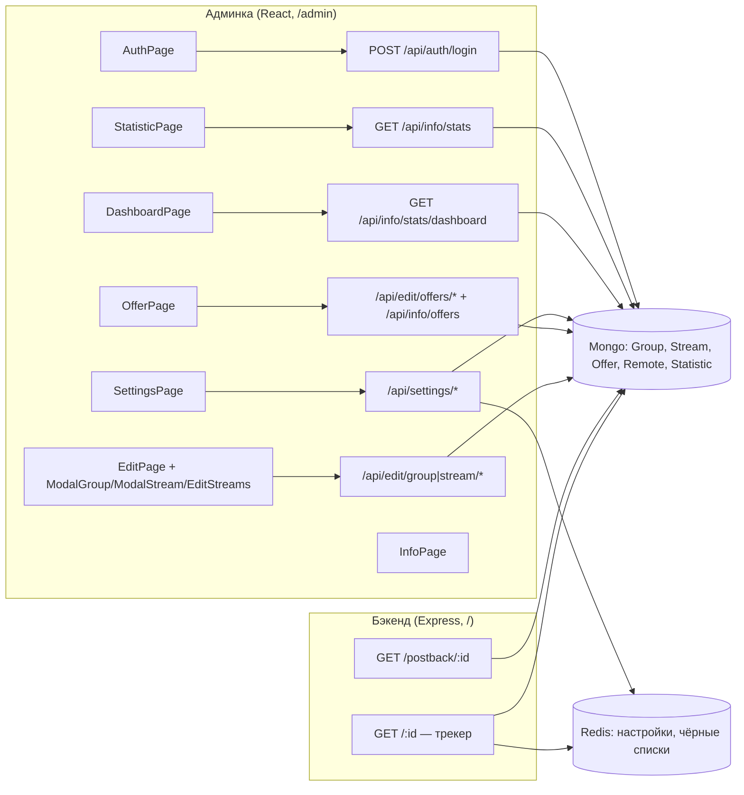

# WhalesTracker — Матрица связей «экран ↔ API»

> Какой экран какие эндпоинты вызывает, когда и с какими параметрами. Основано на [справочнике API](02-api.md) и [описании экранов](04-screens.md). Все вызовы идут через единый хук `useHttp` (fetch, JSON, без токенов — cookie-сессия; авто-logout при 401) — client/src/hooks/http.hook.ts:11-53.

## 1. Матрица «экран → API»

| Экран (маршрут) | API-метод | Момент вызова | Параметры | Обработка ответа |
|---|---|---|---|---|
| **AuthPage** `/auth` | `POST /api/auth/login` | сабмит формы (кнопка Sign In) | body: `{username, password}` | `data.id` → `auth.login(id)` + localStorage `Data`; редирект через смену роутинга (AuthPage.tsx:54-64) |
| **DashboardPage** `/dashboard` | `GET /api/info/stats/dashboard` | mount / смена `interval` (DashboardPage.tsx:30-32); клик Apply в MenuDashboard (MenuDashboard.tsx:115-117) | query: `type, groups, streams, ignoreBot, country` | `stats`→агрегация карточек/графика, `last_click`/`last_amount`→таблицы (DashboardState.tsx:101-126) |
| **Layout** (оболочка всех страниц) | `GET /api/info/groups` | mount / смена `isAuthenticated` (Layout.tsx:36-47) | — | список групп в GroupContext (меню, селекты) |
| **EditPage** `/group/:id` | `GET /api/edit/group/:id` | mount / смена `params.id` (EditPage.tsx:39-41); повторно после сохранения | path: `id` | группа + стримы (сортировка по `position`) в GroupContext |
| | `POST /api/edit/group/:id` | клик Save (EditPage.tsx:24-26) | body: `{group, streams[]}` | повторный `fetchGroups()` + `fetchGroup(id)` |
| | `DELETE /api/edit/group/:id` | клик Delete (EditPage.tsx:28-31) | path: `id` | локальный `REMOVE_GROUP` (ошибки глушатся) |
| | `POST /api/edit/group/create` | сабмит модалки ModalGroup (создание группы с дашборда) | body: поля `IGroupValues` | `data._id` → редирект `/group/:id` (ModalGroup.tsx:95-98) |
| | `POST /api/edit/stream/create` | сохранение нового стрима в ModalStream (ModalStream.tsx:105-110) | body: `{igGroup, ...stream}` | `ADD_STREAM` |
| | `DELETE /api/edit/group/:groupId/:streamId` | клик удаления стрима в EditStreams (EditStreams.tsx:55) | path: `groupId`, `streamId` | `REMOVE_STREAM` |
| **StatisticPage** `/statistic` | `GET /api/info/stats` | mount / смена `type` таба (TabStatistic.tsx:10-12); клик Apply в MenuStatistic (MenuStatistic.tsx:162-164) | query: `type, groups, streams, ignoreBot, startDate, endDate, country` | `data.stats` → таблица/график |
| **OfferPage** `/offers` | `GET /api/info/offers` | mount (OfferPage.tsx:9-11); mount/смена type в `FieldCode` (FieldCode.tsx:29-33) | — | список офферов |
| | `POST /api/edit/offers/edit` | клик сохранения оффера в ListOffers (create и update — единая ручка) | body: `{...offer}` | `SAVE_OFFER` (добавить/заменить) |
| | `DELETE /api/edit/offers/:id` | клик иконки удаления (ListOffers.tsx:49,81) | path: `id` | `DELETE_OFFER` |
| **SettingsPage** `/settings` | `GET /api/settings/info` | mount (SettingsPage.tsx:13-15) | — | объект настроек |
| | `GET /api/settings/info/list?type=` | клик edit списка в OtherOption (OtherOption.tsx:66-81) | query: `type` ∈ blackIps/blackSignatures/listUrl | `FETCH_LIST` |
| | `POST /api/settings/edit/general` | клик Save в GeneralOption (GeneralOption.tsx:73-84) | body: `IGeneralSettings` | локальный `UPDATE` |
| | `POST /api/settings/edit/list` | сабмит модалки списка (save) / клик clear (OtherOption.tsx:69-87) | body: `{action: add/edit/delete/clear, typeList, data[]}` | счётчики `intBlackIp/intBlackSignature/intRemoteUrl` |
| **InfoPage** `/information` | — | — | — | статическая страница, API не вызывает |

Поллинга нет ни у одного экрана (см. отчёт E, §4).

## 2. Обратная секция «API → вызывающие»

| API-метод | Вызывающие |
|---|---|
| `POST /api/auth/login` | AuthPage |
| `GET /api/auth/logout` | **не вызывается клиентом** (нет вызовов в client/src; выход на клиенте — только локальный `logout()` без запроса) |
| `GET /api/edit/dashboard` | **не вызывается** (тестовая заглушка, всегда `'TEST GET'`) |
| `POST /api/edit/offers/edit`, `DELETE /api/edit/offers/:id`, `GET /api/info/offers` | OfferPage (+FieldCode для чтения) |
| `POST /api/edit/group/create`, `GET/POST/DELETE /api/edit/group/:id`, `DELETE /api/edit/group/:id/:streamId` | EditPage, ModalGroup (с DashboardPage), EditStreams |
| `POST /api/edit/stream/create` | ModalStream (EditPage) |
| `POST /api/edit/filters/create` | **не вызывается клиентом** — фильтры сохраняются в составе `POST /api/edit/group/:id` (streams[].filters); эндпоинт-сирота |
| `GET /api/info/groups` | Layout (и после сохранения группы) |
| `GET /api/info/stats` | StatisticPage |
| `GET /api/info/stats/dashboard` | DashboardPage |
| `GET /api/settings/info`, `GET /api/settings/info/list`, `POST /api/settings/edit/general`, `POST /api/settings/edit/list` | SettingsPage |
| `POST /api/settings/statistics/clear` | **не вызывается** (битый путь + TODO, не реализован) |
| `GET /postback/`, `GET /postback/:id` | **внешние** — вызываются партнёрскими CPA-сетями для регистрации конверсии |
| `GET /`, `GET /:id` (трекер) | **внешние** — входящий трафик; редирект по группе |

## 3. Диаграмма

## 4. Замечания для рерайта

- 4 эндпоинта не имеют вызывающих: `GET /api/edit/dashboard`, `POST /api/edit/filters/create`, `POST /api/settings/statistics/clear`, `GET /api/auth/logout` — кандидаты на удаление/переделку.
- Логаут на клиенте не вызывает серверный `logout` — сессия в MongoStore живёт до истечения cookie (24 ч).
- `credentials` в fetch не указан — cookie-сессия работает только same-origin (один домен через nginx).
